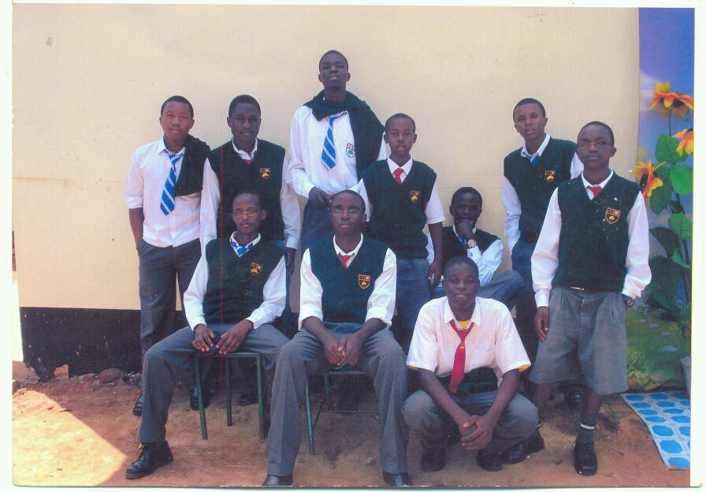
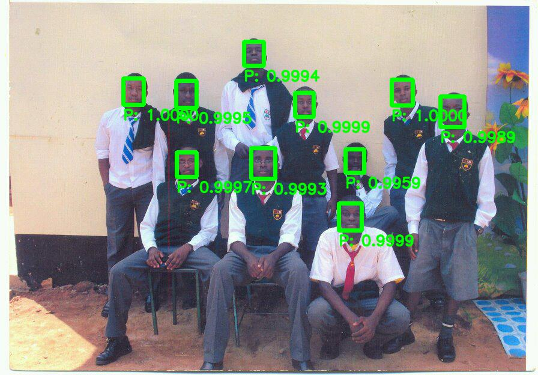

# Face Detect API
This is a simple face detection api that takes as input, an image and gives as output, detected faces on the image. This API can be used as an alternative to the paid face detection APIs currently available as it gives quite good accuracy levels.
the technologies used include: 
- Django
- Docker
- TensorFlow with MTCNN model
- Minio
- PostgreSQL
- RabbitMQ
- Redis
- Celery

## Architecture

The architecture used is a micro-service architecture with asynchronous processing of requests.
The diagram below highlights the architecture used;


## Local Deployment

To deploy the API locally, run the following commands
- Clone this repo `git clone https://github.com/urandu/face_detect_api.git`
- `cd fac_detect_api`
- Run `docker-compose up `
- Wait for the necessary docker images to be pulled and started
- On a different terminal, run `docker-compose run api python manage.py makemigrations`
- Then run `docker-compose run api python manage.py migrate`
- (Optional) create superuser by running `docker-compose run api python manage.py createsuperuser` you will be prompted for a username, email and password. these are the admin credentials for django admin

- To test our API, we shall send a post request to the endpoint `http://localhost:8900/api/image/`

 ```
curl -i -X POST -H "Content-Type: multipart/form-data" 
-F "request_id=12345" -F "callback_url=<replace with requestbin.com endpoint>" -F "image=<path to image>" http://localhost:8900/api/image/

```
- callback response
```
{
    "image_id": "0a5a49c6-18dc-4b3a-b984-70476280aa13",
    "request_id": "123456789",
    "faces": [
        {
            "confidence": "0.9999778270721436",
            "box": "[205, 130, 34, 44]",
            "keypoints": "{'left_eye': (216, 146), 'right_eye': (233, 148), 'nose': (224, 157), 'mouth_left': (216, 165), 'mouth_right': (230, 166)}"
        },
        {
            "confidence": "0.9999626874923706",
            "box": "[652, 132, 35, 43]",
            "keypoints": "{'left_eye': (662, 151), 'right_eye': (678, 148), 'nose': (670, 156), 'mouth_left': (666, 167), 'mouth_right': (679, 165)}"
        },
        {
            "confidence": "0.9999274015426636",
            "box": "[564, 338, 38, 45]",
            "keypoints": "{'left_eye': (576, 355), 'right_eye': (595, 355), 'nose': (586, 364), 'mouth_left': (577, 374), 'mouth_right': (593, 374)}"
        },
        {
            "confidence": "0.9998524188995361",
            "box": "[491, 154, 31, 40]",
            "keypoints": "{'left_eye': (501, 170), 'right_eye': (516, 170), 'nose': (509, 177), 'mouth_left': (502, 186), 'mouth_right': (515, 186)}"
        },
        {
            "confidence": "0.9997138381004333",
            "box": "[294, 253, 33, 41]",
            "keypoints": "{'left_eye': (303, 269), 'right_eye': (319, 267), 'nose': (310, 277), 'mouth_left': (304, 285), 'mouth_right': (319, 284)}"
        },
        {
            "confidence": "0.9995110034942627",
            "box": "[293, 134, 34, 45]",
            "keypoints": "{'left_eye': (304, 150), 'right_eye': (321, 151), 'nose': (313, 161), 'mouth_left': (305, 168), 'mouth_right': (320, 169)}"
        },
        {
            "confidence": "0.999414324760437",
            "box": "[406, 69, 33, 40]",
            "keypoints": "{'left_eye': (414, 83), 'right_eye': (431, 82), 'nose': (423, 89), 'mouth_left': (417, 100), 'mouth_right': (431, 99)}"
        },
        {
            "confidence": "0.9993127584457397",
            "box": "[418, 246, 40, 51]",
            "keypoints": "{'left_eye': (429, 265), 'right_eye': (449, 266), 'nose': (438, 275), 'mouth_left': (430, 286), 'mouth_right': (446, 287)}"
        },
        {
            "confidence": "0.9989363551139832",
            "box": "[733, 160, 40, 51]",
            "keypoints": "{'left_eye': (743, 180), 'right_eye': (763, 180), 'nose': (751, 189), 'mouth_left': (744, 200), 'mouth_right': (761, 200)}"
        },
        {
            "confidence": "0.995890200138092",
            "box": "[575, 248, 31, 39]",
            "keypoints": "{'left_eye': (585, 262), 'right_eye': (601, 262), 'nose': (593, 269), 'mouth_left': (585, 277), 'mouth_right': (598, 278)}"
        }
    ],
    "output_image_url": "localhost:8900/api/image/?image_id=0a5a49c6-18dc-4b3a-b984-70476280aa13"
}

```


Below is an example image We used:
##### input image

##### output image


Please take a look at [this medium article] (https://medium.com/@urandu/build-a-production-ready-face-detection-api-part-1-c56cbe9592bf) on how we developed the API 